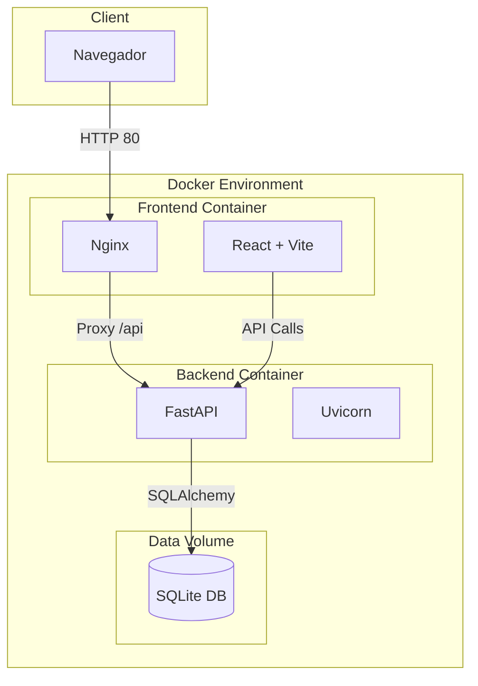
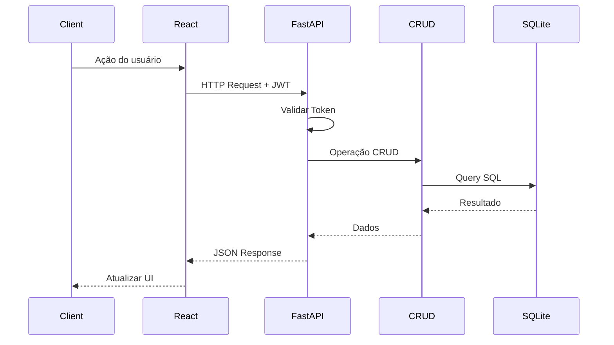
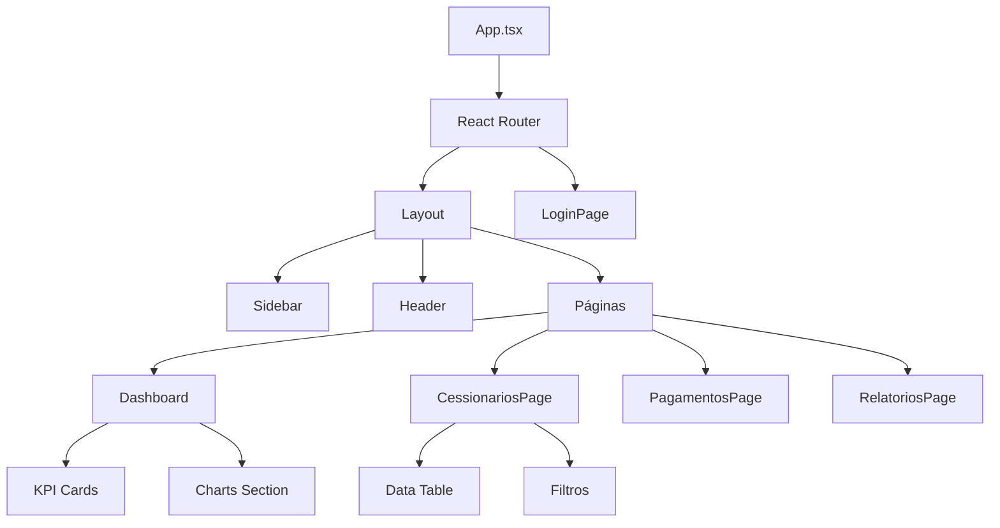
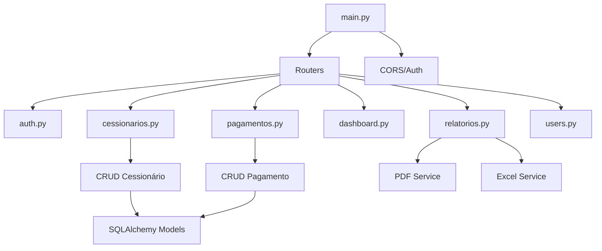
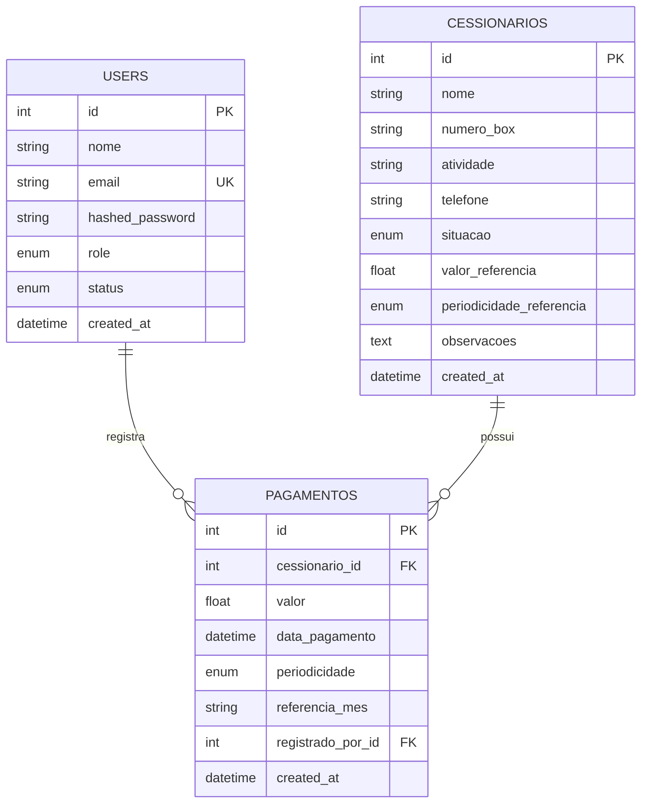

# Arquitetura do Sistema

## Diagrama de Arquitetura

```mermaid
graph TB
    subgraph "Docker Environment"
        subgraph "Frontend Container"
            Nginx[Nginx]
            React[React + Vite]
        end
        
        subgraph "Backend Container"
            FastAPI[FastAPI]
            Uvicorn[Uvicorn]
        end
        
        subgraph "Data Volume"
            SQLite[(SQLite DB)]
        end
    end
    
    subgraph "Client"
        Browser[Navegador]
    end
    
    Browser -->|HTTP 80| Nginx
    Nginx -->|Proxy /api| FastAPI
    React -->|API Calls| FastAPI
    FastAPI -->|SQLAlchemy| SQLite
```

## Fluxo de Dados

```mermaid
sequenceDiagram
    participant Client
    participant React
    participant API as FastAPI
    participant CRUD
    participant DB as SQLite
    
    Client->>React: Ação do usuário
    React->>API: HTTP Request + JWT
    API->>API: Validar Token
    API->>CRUD: Operação CRUD
    CRUD->>DB: Query SQL
    DB-->>CRUD: Resultado
    CRUD-->>API: Dados
    API-->>React: JSON Response
    React-->>Client: Atualizar UI
```

## Estrutura de Componentes Frontend

```mermaid
graph TD
    App[App.tsx] --> Router[React Router]
    Router --> Layout[Layout]
    Router --> Login[LoginPage]
    
    Layout --> Sidebar[Sidebar]
    Layout --> Header[Header]
    Layout --> Pages[Páginas]
    
    Pages --> Dashboard[Dashboard]
    Pages --> Cessionarios[CessionariosPage]
    Pages --> Pagamentos[PagamentosPage]
    Pages --> Relatorios[RelatoriosPage]
    
    Dashboard --> KPIs[KPI Cards]
    Dashboard --> Charts[Charts Section]
    
    Cessionarios --> DataTable[Data Table]
    Cessionarios --> Filters[Filtros]
```

## Estrutura do Backend

```mermaid
graph TD
    Main[main.py] --> API[Routers]
    Main --> Middleware[CORS/Auth]
    
    API --> Auth[auth.py]
    API --> Cess[cessionarios.py]
    API --> Pag[pagamentos.py]
    API --> Dash[dashboard.py]
    API --> Rel[relatorios.py]
    API --> Users[users.py]
    
    Cess --> CRUD_Cess[CRUD Cessionário]
    Pag --> CRUD_Pag[CRUD Pagamento]
    
    CRUD_Cess --> Models[SQLAlchemy Models]
    CRUD_Pag --> Models
    
    Rel --> PDF[PDF Service]
    Rel --> Excel[Excel Service]
```

## Modelo de Dados

```mermaid
erDiagram
    USERS {
        int id PK
        string nome
        string email UK
        string hashed_password
        enum role
        enum status
        datetime created_at
    }
    
    CESSIONARIOS {
        int id PK
        string nome
        string numero_box
        string atividade
        string telefone
        enum situacao
        float valor_referencia
        enum periodicidade_referencia
        text observacoes
        datetime created_at
    }
    
    PAGAMENTOS {
        int id PK
        int cessionario_id FK
        float valor
        datetime data_pagamento
        enum periodicidade
        string referencia_mes
        int registrado_por_id FK
        datetime created_at
    }
    
    USERS ||--o{ PAGAMENTOS : registra
    CESSIONARIOS ||--o{ PAGAMENTOS : possui
```
